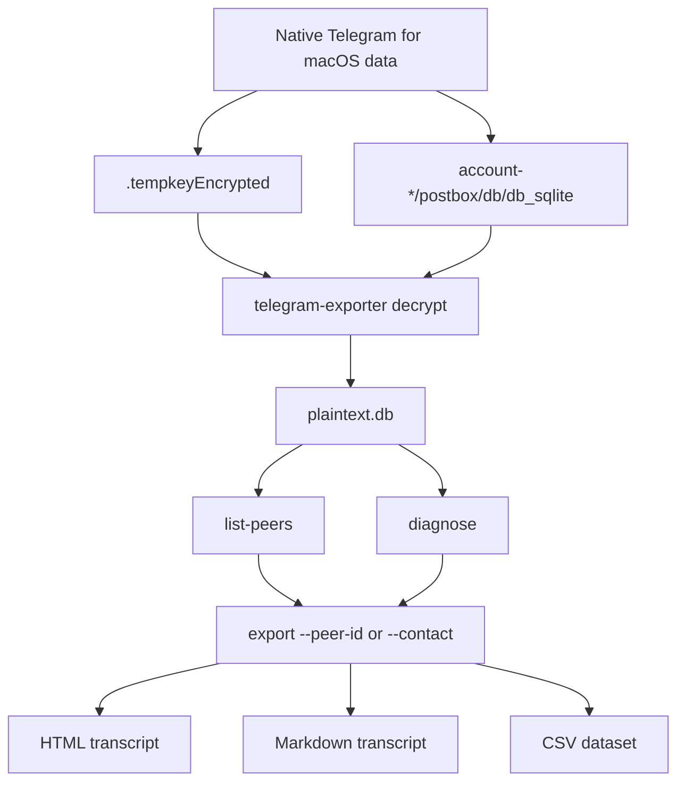
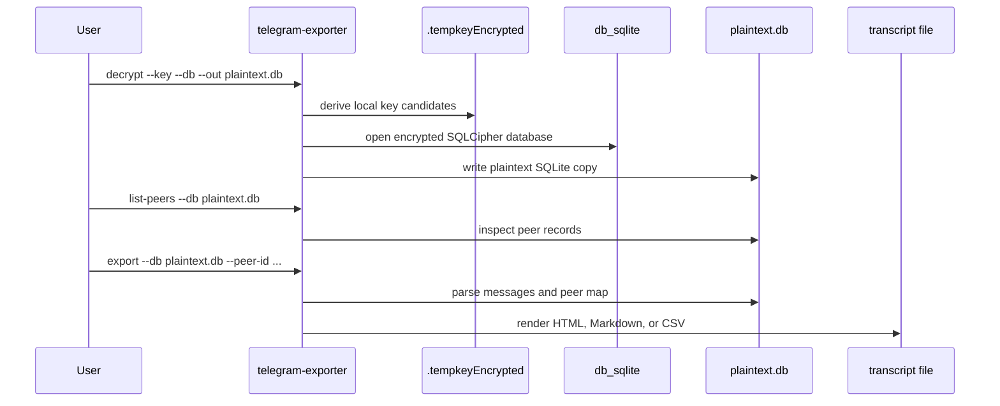

# 💬 Telegram for macOS Message Exporter

> Offline recovery and transcript export for the native Telegram for macOS app.

[](https://github.com/soakes/telegram-message-exporter/actions/workflows/ci.yml)
[](https://www.python.org/downloads/)
[](#requirements)
[](https://macos.telegram.org/)
[](LICENSE)
[](https://black.readthedocs.io/)
[](https://docs.astral.sh/ruff/)
[](https://pylint.readthedocs.io/)

Built for recovery situations where the only remaining copy of a Telegram
conversation is the encrypted local cache on a Mac. The tool decrypts the local
`db_sqlite`, understands Telegram's Postbox storage well enough to find peers
and messages, then writes a readable transcript in HTML, Markdown, or CSV.

This targets the **native Telegram for macOS app** from
[macos.telegram.org](https://macos.telegram.org/), the Homebrew `telegram` cask,
or a copied Mac App Store container when it exposes the same
`account-*/postbox` layout. Other clients and operating systems may work only
when you can provide a compatible plaintext Postbox SQLite database and media
cache root manually; automatic path discovery and decryption are currently built
for native macOS Telegram containers.

**Quick links:** [🚀 Quick Start](#quick-start) · [🔄 How It Works](#how-it-works) · [🧪 Usage](#usage) · [🧰 CLI Reference](#cli-reference) · [🩺 Troubleshooting](#troubleshooting) · [🙏 Credits](#credits)

## 🧭 Table of Contents

- [📖 Overview](#overview)
- [✨ Capabilities](#capabilities)
- [🔄 How It Works](#how-it-works)
- [✅ Requirements](#requirements)
- [🚀 Quick Start](#quick-start)
- [🧪 Usage](#usage)
- [🧰 CLI Reference](#cli-reference)
- [📄 Output Formats](#output-formats)
- [🗺️ Key Paths](#key-paths)
- [🔐 Safety and Privacy](#safety-and-privacy)
- [🩺 Troubleshooting](#troubleshooting)
- [⚠️ Limitations](#limitations)
- [❓ FAQ](#faq)
- [🔖 Versioning](#versioning)
- [🧹 Quality Checks](#quality-checks)
- [🗂️ Project Structure](#project-structure)
- [🙏 Credits](#credits)
- [🤝 Contributing](#contributing)
- [📄 License](#license)

---

<a id="overview"></a>

## 📖 Overview

Telegram for macOS stores local message data in an encrypted SQLite database.
When a chat has been deleted from Telegram's cloud state, the local cache can be
the last useful source of evidence, provided it still exists on disk and has
not been overwritten or synced away.

`telegram-message-exporter` provides a focused recovery path:

- decrypt the local SQLCipher database using `.tempkeyEncrypted`
- inspect the resulting plaintext SQLite copy
- list likely peers and contacts
- export one chat or all decoded messages to a clean transcript

The tool is intentionally offline. It does not call Telegram APIs, restore
messages back into Telegram, or upload recovered data anywhere.

### First Recovery Checklist

1. Stop using Telegram on the Mac as soon as possible.
2. Keep the Mac offline if you are trying to preserve a recently deleted chat.
3. Copy the Telegram key and database to a separate working directory before
   experimenting.
4. Install the tool in a virtual environment.
5. Decrypt to `plaintext.db`.
6. Run `list-peers` to find the chat you care about.
7. Export HTML first for reading, then CSV if you need analysis in a
   spreadsheet.
8. Store `plaintext.db` and transcript files securely; they contain private
   message content.

---

<a id="capabilities"></a>

## ✨ Capabilities

- **Offline decryption**: derives SQLCipher keys from Telegram's local
  `.tempkeyEncrypted` file
- **Passcode support**: accepts `--passcode` or `TG_LOCAL_PASSCODE` when
  Telegram Passcode Lock is enabled
- **Postbox parsing**: handles the native macOS app's key/value Postbox tables
  and can export from compatible plaintext Postbox SQLite databases when you
  provide the path manually
- **Peer discovery**: searches local peer records so exports can use names
  instead of raw IDs where possible
- **Targeted exports**: filters by peer ID, contact name, message limit, start
  date, and end date
- **Readable output**: writes styled HTML, Markdown, or CSV with timestamps,
  speakers, directions, and link handling
- **Telegram-like HTML viewer**: separates all chats, filters private chats,
  groups, channels, bots, and deleted accounts, and includes global search,
  per-chat message result lists, plus media, files, urls, pinned, and analytics
  tabs
- **Local media export**: records decoded media/file references and copies
  locally available cached files when you provide a media/cache root; media
  copying uses parallel workers by default
- **Recovered local previews**: restores peer avatars, cached stickers/GIFs,
  and location map previews when Telegram kept them in the local cache
- **Richer message metadata**: renders web page previews, polls, shared contacts,
  dice, locations, forwarded sources, pinned-message tags, and service/action
  messages when those objects are present in Postbox
- **Progress output**: long exports print stage and media-index progress to
  stderr, with `--no-progress` available for quiet scripted runs
- **Diagnostics**: samples tables and rows when Telegram storage changes or a
  cache does not match the expected shape

---

<a id="how-it-works"></a>

## 🔄 How It Works

The normal recovery flow has two phases: decrypt the database, then export from
the plaintext copy.



The CLI never needs Telegram network access. Everything comes from local files
that already exist on the Mac.



---

<a id="requirements"></a>

## ✅ Requirements

- macOS with native Telegram for macOS data present
- Python 3.10 or newer
- SQLCipher support for the `sqlcipher3` Python package
- Telegram local passcode, if Passcode Lock was enabled
- A virtual environment for local installs

On macOS, install SQLCipher first if `sqlcipher3` fails to build:

```bash
brew install sqlcipher
```

### Client and OS support

The complete recovery flow is tested with native Telegram for macOS data:
`discover` knows the standard macOS container layout, and `decrypt` expects the
native `.tempkeyEncrypted` plus `account-*/postbox/db/db_sqlite` pair.

The exporter itself works one layer lower. If you already have a compatible
plaintext Postbox SQLite database with tables such as `t2`, `t6`, and `t7`, you
can run `telegram-exporter export --db /path/to/plaintext.db` on it and pass a
matching `--media-root` manually. That can be useful for copied containers from
other Telegram builds or operating systems, but those paths and key formats are
not auto-detected yet.

---

<a id="quick-start"></a>

## 🚀 Quick Start

### 1. Install

From a clone:

```bash
git clone https://github.com/soakes/telegram-message-exporter.git
cd telegram-message-exporter
python3 -m venv .venv
source .venv/bin/activate
pip install -e .
```

Or install the latest revision directly from GitHub:

```bash
pip install -U "git+https://github.com/soakes/telegram-message-exporter.git"
```

### 2. Locate Telegram's database

Ask the exporter to find the native macOS container and account paths:

```bash
telegram-exporter discover
```

For a copied dump, point discovery at the copied container root:

```bash
telegram-exporter discover --dump-root /path/to/copied/telegram-container
```

You need the paths reported for:

- `.tempkeyEncrypted`, which is hidden from plain `ls` because it starts with `.`
- the matching `account-*/postbox/db/db_sqlite`

### 3. Decrypt to a working copy

```bash
telegram-exporter decrypt \
  --key /path/to/.tempkeyEncrypted \
  --db /path/to/account-id/postbox/db/db_sqlite \
  --out recovery/plaintext.db
```

If Telegram Passcode Lock is enabled:

```bash
TG_LOCAL_PASSCODE="your-passcode" \
telegram-exporter decrypt \
  --key /path/to/.tempkeyEncrypted \
  --db /path/to/account-id/postbox/db/db_sqlite \
  --out recovery/plaintext.db
```

### 4. Find a peer

```bash
telegram-exporter list-peers --db recovery/plaintext.db --search "Alex"
```

### 5. Export a transcript

```bash
telegram-exporter export \
  --db recovery/plaintext.db \
  --peer-id 123456789 \
  --me-name "Me" \
  --format html \
  --out recovery/alex.html
```

---

<a id="usage"></a>

## 🧪 Usage

### Export HTML for one chat

```bash
telegram-exporter export \
  --db recovery/plaintext.db \
  --peer-id 123456789 \
  --format html \
  --me-name "Me" \
  --out recovery/chat.html
```

### Export by contact name

```bash
telegram-exporter export \
  --db recovery/plaintext.db \
  --contact "Alex" \
  --format md \
  --out recovery/alex.md
```

If more than one peer matches, the command prints the candidates and asks you to
rerun with `--peer-id`.

### Export a date range

```bash
telegram-exporter export \
  --db recovery/plaintext.db \
  --peer-id 123456789 \
  --start-date 2024-01-01 \
  --end-date 2024-12-31 \
  --format html \
  --out recovery/chat-2024.html
```

### Export all decoded messages

```bash
telegram-exporter export \
  --db recovery/plaintext.db \
  --format html \
  --out recovery/all-chats.html
```

HTML exports group all decoded chats in a Telegram-like sidebar when no
`--peer-id` or `--contact` filter is provided. HTML is split into one index
file plus one HTML file per chat by default, which keeps large all-chat exports
much more responsive while still opening from `all-chats.html`.

### Export from a copied full dump

```bash
telegram-exporter discover \
  --dump-root /path/to/copied/telegram-root
```

For a dump with the native macOS container, the command detects paths like:

```text
<telegram-container>/<stable-or-appstore>/.tempkeyEncrypted
<telegram-container>/<stable-or-appstore>/account-*/postbox/db/db_sqlite
<telegram-container>/<stable-or-appstore>/account-*/postbox/media
```

After `decrypt`, the exporter writes source metadata next to
`recovery/plaintext.db`. A later HTML export can use that metadata to locate
`account-*/postbox/media` automatically:

```bash
telegram-exporter export \
  --db recovery/plaintext.db \
  --format html \
  --out recovery/all-chats.html
```

The native macOS media cache commonly stores content files directly below
`postbox/media` with names such as `telegram-cloud-document-*` and
`telegram-cloud-photo-size-*`. The exporter indexes those Telegram resource
names, peer avatar resources such as `telegram-peer-photo-size-*`, and cached
sticker documents. It also resolves Postbox referenced media records before
copying, so photos, GIFs, stickers, voice messages, and files that are stored as
message references can still be matched against the local cache.

### Inspect an unfamiliar database

```bash
telegram-exporter diagnose --db recovery/plaintext.db
```

Sample a specific table:

```bash
telegram-exporter diagnose --db recovery/plaintext.db --table t7
```

### Debug decryption

```bash
telegram-exporter decrypt \
  --key /path/to/.tempkeyEncrypted \
  --db /path/to/db_sqlite \
  --out recovery/plaintext.db \
  --debug
```

---

<a id="cli-reference"></a>

## 🧰 CLI Reference

| Command | Purpose |
| --- | --- |
| `decrypt` | Decrypt Telegram's encrypted `db_sqlite` to a plaintext SQLite file |
| `discover` | Find key, message DB, and media cache paths in a copied Telegram dump |
| `diagnose` | List tables, columns, and sample rows from a plaintext database |
| `list-peers` | Find likely peer IDs by name fragment |
| `export` | Render messages to HTML, Markdown, or CSV |

### `decrypt`

| Flag | Required | Description |
| --- | --- | --- |
| `--key` | yes | Path to `.tempkeyEncrypted` |
| `--db` | yes | Path to encrypted `db_sqlite` |
| `--out` | no | Output plaintext DB path, default `plaintext.db` |
| `--passcode` | no | Telegram local passcode; can also use `TG_LOCAL_PASSCODE` |
| `--debug` | no | Print key/profile diagnostics |

### `diagnose`

| Flag | Required | Description |
| --- | --- | --- |
| `--db` | yes | Path to plaintext SQLite database |
| `--table` | no | Table to sample; defaults to `t7` when present |

### `discover`

| Flag | Required | Description |
| --- | --- | --- |
| `--dump-root` | no | Root of a copied Telegram container/dump; defaults to Telegram's standard macOS Group Containers path |

### `list-peers`

| Flag | Required | Description |
| --- | --- | --- |
| `--db` | yes | Path to plaintext SQLite database |
| `--search` | no | Name fragment to filter peers |

### `export`

| Flag | Required | Description |
| --- | --- | --- |
| `--db` | yes | Path to plaintext SQLite database |
| `--contact` | no | Contact name to resolve to a peer |
| `--peer-id` | no | Numeric peer ID to export |
| `--table` | no | Override detected message table |
| `--limit` | no | Maximum number of messages |
| `--start-date` | no | Start date, `YYYY-MM-DD` or ISO datetime |
| `--end-date` | no | End date, `YYYY-MM-DD` or ISO datetime |
| `--format` | no | `html`, `md`, or `csv`; default `md` |
| `--out` | no | Output path; defaults to `chat_export.<format>` |
| `--me-name` | no | Display label for outgoing messages; default `Me` |
| `--copy-media` | no | Copy locally available media/files referenced by decoded messages |
| `--media-root` | no | Directory to search for Telegram media/cache files; also enables media copy |
| `--media-dir` | no | Directory for copied media; defaults to `<export-name>_media` |
| `--media-workers` | no | Number of parallel workers for copying media files; defaults to up to 8 |
| `--single-html` | no | For HTML, write one large file instead of per-chat pages |
| `--show-direction` | no | Append `(in)` or `(out)` labels in Markdown |
| `--no-progress` | no | Do not print export progress to stderr |

---

<a id="output-formats"></a>

## 📄 Output Formats

| Format | Best for | Notes |
| --- | --- | --- |
| `html` | Reading and sharing a polished transcript | Telegram-like chat layout, chat-type filters, global and per-chat search, media/files/urls/pinned/analytics tabs, optional split pages, and link handling |
| `md` | Archival text, notes, version control | Compact, portable, easy to diff, and includes attachment, pinned, and forwarded references |
| `csv` | Analysis in spreadsheets or scripts | Includes date, time, Unix timestamp, direction, speaker, text, attachments, forwarded source, pinned flag, peer ID, and author ID |

### Markdown snippet

```markdown
# Telegram Chat History: Alex Example

**Exported:** 2026-02-04 16:05:12

**Total Messages:** 418

---

## Wednesday, February 04, 2026

**14:13:09 — Me**

3h48 is good also
```

### CSV snippet

```csv
date,time,timestamp,direction,speaker,text,attachments,attachment_paths,forwarded_from,pinned,peer_id,author_id
2026-02-04,14:13:09,1770214389,out,Me,"3h48 is good also","",,,,123456789,123456789
```

---

<a id="key-paths"></a>

## 🗺️ Key Paths

Native Telegram for macOS typically stores recovery-relevant files here:

```text
~/Library/Group Containers/<telegram-container>/<stable-or-appstore>/
├── .tempkeyEncrypted
└── account-*/
    └── postbox/
        ├── db/
        │   └── db_sqlite
        └── media/
```

The `account-*` directory must match the database you are decrypting. If there
are multiple accounts, try `list-peers` after decrypting each one and keep notes
about which plaintext database came from which account directory.

---

<a id="safety-and-privacy"></a>

## 🔐 Safety and Privacy

- Work from copies of Telegram files whenever possible.
- Keep the Mac offline during time-sensitive recovery to avoid sync changes.
- Treat `plaintext.db`, HTML, Markdown, and CSV outputs as sensitive private
  data.
- Delete or encrypt intermediate files when recovery work is complete.
- The tool reads local files and writes local outputs only; it does not contact
  Telegram or any third-party recovery service.

---

<a id="troubleshooting"></a>

## 🩺 Troubleshooting

| Symptom | What to check |
| --- | --- |
| `Key file not found` | Confirm the `.tempkeyEncrypted` path and quote paths containing spaces |
| `Database file not found` | Confirm the selected `account-*` directory has `postbox/db/db_sqlite` |
| `Failed to decrypt database` | Verify the key and DB belong to the same Telegram account; pass `--passcode` if Passcode Lock was enabled |
| `file is not a database` | Usually a mismatched key/database pair or an unsupported SQLCipher profile |
| `No peer records found` | Run `diagnose` and confirm this is the native macOS Telegram database |
| `No messages found with the current filters` | Remove date filters, confirm `--peer-id`, or try exporting all decoded messages |
| `sqlcipher3` install fails | Install SQLCipher with Homebrew, then reinstall the package in a clean virtual environment |

For decryption problems, rerun with `--debug`:

```bash
telegram-exporter decrypt \
  --key /path/to/.tempkeyEncrypted \
  --db /path/to/db_sqlite \
  --out recovery/plaintext.db \
  --debug
```

---

<a id="limitations"></a>

## ⚠️ Limitations

- Does not restore messages into Telegram.
- Does not bypass a Telegram local passcode; you need the passcode.
- Does not recover messages that no longer exist in the local cache.
- Does not download content from Telegram servers.
- Media/file export is best-effort and only copies files already present on the
  Mac. If Telegram did not cache a file locally, the transcript keeps the
  decoded reference but cannot recreate the missing content. Encrypted or
  proprietary media resource cache files may still need a dedicated decoder.
- Some newer or uncommon Telegram message payloads may only partially decode.
- Does not auto-discover or decrypt Telegram Desktop/Qt, Windows, Linux, mobile
  backups, or Telegram cloud export archives.

---

<a id="faq"></a>

## ❓ FAQ

### Can this restore a deleted chat inside Telegram?

No. It exports a transcript from local data; it does not write messages back to
Telegram.

### Should I use the original Telegram database directly?

The command can read it, but for recovery work it is safer to copy the key and
database into a separate working directory and decrypt from that copy.

### Does this only support Telegram for macOS?

The built-in `discover` and `decrypt` flow is for native Telegram for macOS
containers. The `export` command can still process a compatible plaintext
Postbox SQLite database from another source when you provide the database path
and any media root manually. Telegram Desktop/Qt and other operating systems use
different paths and may use different key/storage formats, so they are not
automatic recovery targets yet.

### Does it work with the Mac App Store version?

Yes, when a copied Mac App Store container has the same
`account-*/postbox/db/db_sqlite` and `account-*/postbox/media` layout. Use
`telegram-exporter discover --dump-root /path/to/copied/telegram-container` to
let the tool locate the key, message database, and media root.

### Can it recover photos, videos, or documents?

Yes, when the content is still available locally. Pass `--media-root` pointing
at the Telegram data/cache tree, and the exporter will copy matched files next
to the transcript. It does not download missing media from Telegram servers.
If the cache entry is still encrypted or stored in a Telegram-specific resource
format, the exporter keeps the reference in the transcript but may not be able
to turn it into a normal photo/video/document yet.

---

<a id="versioning"></a>

## 🔖 Versioning

The canonical version is stored in [`VERSION`](VERSION) and exposed by the CLI:

```bash
telegram-exporter --version
```

Use the helper script when preparing a version bump:

```bash
.github/scripts/bump_version.py patch
.github/scripts/bump_version.py minor
.github/scripts/bump_version.py major
.github/scripts/bump_version.py --set 1.2.3
```

---

<a id="quality-checks"></a>

## 🧹 Quality Checks

The CI workflow runs Black, Ruff, and Pylint across Python 3.10 through 3.14.

```bash
pip install black ruff pylint
black --check src/telegram_message_exporter telegram_exporter.py .github/scripts/bump_version.py
ruff check src/telegram_message_exporter telegram_exporter.py .github/scripts/bump_version.py
pylint src/telegram_message_exporter telegram_exporter.py
```

---

<a id="project-structure"></a>

## 🗂️ Project Structure

```text
telegram-message-exporter/
├── .github/
│   ├── dependabot.yml                 # Dependency update schedule
│   ├── scripts/
│   │   └── bump_version.py            # Version helper
│   └── workflows/
│       └── ci.yml                     # Python lint matrix
├── pyproject.toml                     # Packaging metadata and CLI entrypoint
├── telegram_exporter.py               # Convenience wrapper for source checkouts
├── src/
│   └── telegram_message_exporter/
│       ├── __init__.py                # Version metadata
│       ├── __main__.py                # python -m entrypoint
│       ├── cli.py                     # Argument parsing and commands
│       ├── crypto.py                  # SQLCipher and tempkey handling
│       ├── db.py                      # DB heuristics and message extraction
│       ├── exporters.py               # HTML, Markdown, and CSV renderers
│       ├── hashing.py                 # MurmurHash helper
│       ├── models.py                  # Message data model
│       ├── postbox.py                 # Postbox parsing utilities
│       └── utils.py                   # Date parsing and link helpers
├── requirements.txt                   # Runtime dependencies
├── VERSION                            # Canonical package version
├── LICENSE
└── README.md
```

---

<a id="credits"></a>

## 🙏 Credits

This project builds on community reverse-engineering work. Special thanks to
**[@stek29](https://github.com/stek29)** for the original research and
[reference implementation](https://gist.github.com/stek29/8a7ac0e673818917525ec4031d77a713)
of Telegram for macOS local key format and Postbox structure.

---

<a id="contributing"></a>

## 🤝 Contributing

Issues and pull requests are welcome, especially for:

- additional Telegram for macOS storage variants
- safer recovery workflows
- better Postbox decoding
- export formatting improvements
- tests around real-world cache shapes

Please keep recovery and privacy in mind when sharing examples. Do not attach
private Telegram databases or transcripts to public issues.

---

<a id="license"></a>

## 📄 License

This project is licensed under the MIT License. See [`LICENSE`](LICENSE) for
details.
